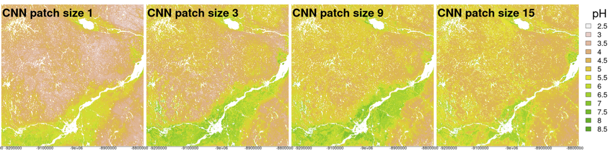

# Presentation: Evaluating Digital Soil Maps by their patterns

Digital soil maps are usually evaluated by point-wise “validation statistics”. This evaluation is quite limited:

- It is based on a necessarily limited number of observations, far fewer than the number of predictions (grid cells, pixels).
- The evaluation points are very rarely from an independent probability sample.
- Cross-validation and data-splitting approaches rely on a biased point set.
- Evidence has shown that widely different DSM approaches can result in maps with quite similar “validation statistics” but obviously different spatial patterns (CNN) with different window sizes.
- Soils are managed as units, not point-wise.
- Land-surface models often rely on 2D or 3D connectivity between grid cells.
- More than a century of fieldwork has shown that soils occur in more-or-less homogeneous patches of various sizes, not as isolated pedons.

This presentation starts from these problems and proposes to evaluate DSM products by their spatial patterns.

